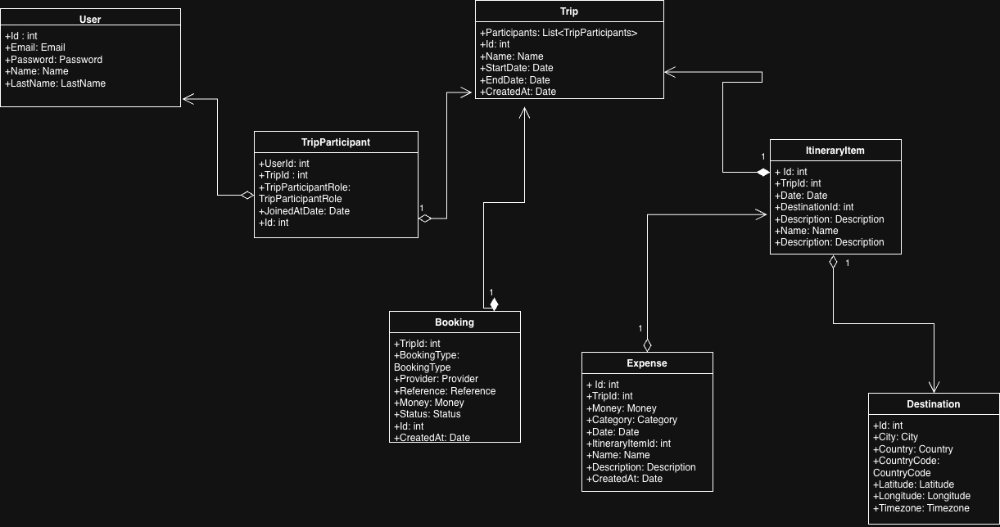

# PeerT — Travel Companion Backend

PeerT is a travel companion application designed to help users plan, organize, and manage their trips in a single place.

This repository contains the **backend service**, built with **Node.js and TypeScript**, following **Clean Architecture principles**. The backend is responsible for handling business logic, integrations with external travel-related APIs, and user-specific data management.

---

## 🚀 Project Vision

PeerT aims to become a smart travel assistant that helps users:

- Organize trips and destinations
- Plan itineraries and activities
- Track expenses and bookings
- Retrieve contextual travel information such as weather, currency exchange, and flight options
- Compare travel options and offers based on user preferences

The application is designed to evolve incrementally, starting from a solid domain-driven backend.

---

## 🧱 Architecture

The backend follows **Clean Architecture**, with clear separation of concerns:

- **Domain**  
  Core business entities and value objects. No framework or infrastructure dependencies.

- **Application**  
  Use cases that orchestrate business rules and domain logic.

- **DataAccess**  
  Implementations for repositories and integrations with external services and APIs.

- **API**  
  HTTP layer (Express) exposing the backend functionality.

This structure ensures scalability, testability, and long-term maintainability.

---

## 📐 Domain Model

> This diagram represents the core domain model and aggregate boundaries,
> following Domain-Driven Design and Clean Architecture principles.

---

## 🛠️ Tech Stack

- Node.js
- TypeScript
- Express
- Clean Architecture
- External Travel APIs (Weather, Currency Exchange, Flights, Hotels)
- Prisma ORM
- Docker and Azure for deployment and containerization
---

## 📌 Project Status

This project is currently in **early development**, with a focus on:
- Domain modeling
- Core entities and value objects
- Foundational backend architecture

Features and integrations will be added incrementally.

